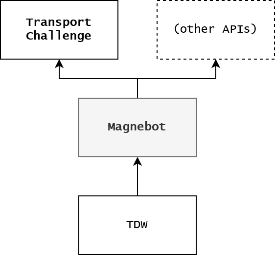

# Magnebot

Magnebot is a high-level robotics-like API for [TDW](https://github.com/threedworld-mit/tdw). The Magnebot can move around the scene and manipulate objects by picking them up with "magnets". The simulation is entirely driven by physics.


**[Read the Magnebot API documentation here.](https://github.com/alters-mit/magnebot/blob/main/doc/api/magnebot_controller.md)**

- The Magnebot can be loaded into a [wide variety of scenes populated by interactable objects](https://github.com/alters-mit/magnebot/tree/main/doc/images/floorplans). 
- All of the Magnebot's possible movements are divided into "actions", each corresponding to an API call, such as `turn_by()` and `move_to()`. Arm articulation is driven by an inverse kinematics (IK) system: specify a target position or object in the action `reach_for(target, arm)` and the `arm` will calculate a solution to reach the `target`. 
- At the end of every action, the Magnebot controller script will return [scene state data](https://github.com/alters-mit/magnebot/blob/main/doc/scene_state.md), which includes an image, a depth map, a segmentation color map, and physics metadata for each body part of the robot and each object in the scene.

# Requirements

See [Getting Started With TDW](https://github.com/threedworld-mit/tdw/blob/master/Documentation/getting_started.md#Requirements):

- Both the Magnebot API and the simulation executable ("the build") run on Windows, OS X, or Linux.

- The Magnebot API requires Python 3.6 or newer.
- The build requires a GPU.
- The Magnebot API doesn't include audio/visual recording or Flex; you can ignore the requirements for those features.

# Installation

1. Clone the `tdw` repo if you haven't already
2. `cd path/to/tdw/Python` (replace `path/to` with the actual path)
3. `git checkout magnebot`
4. `pip3 install -e .`
5. Clone this repo
6. `cd path/to/magnebot` (replace `path/to` with the actual path)
7. `pip3 install -e .`
8. [Download a test build](https://github.com/threedworld-mit/tdw/releases/tag/magnebot_test) and unzip it.

# Usage

1. Run this controller:

```python
from magnebot import Magnebot, Arm

m = Magnebot()

# Initialize the scene, populate it with objects, and add the Magnebot.
# This can take a few minutes to finish.
m.init_scene(scene="1a", layout=0, room=1)

# Reach for a target position.
status = m.reach_for(arm=Arm.left, target={"x": 0.1, "y": 0.6, "z": 0.4}, absolute=False)
print(status) # ActionStatus.success

# Save images.
m.state.save_images(output_directory="magnebot_test_images")

# End the simulation.
m.end()
```

2. [Launch the TDW build.](https://github.com/threedworld-mit/tdw/blob/master/Documentation/getting_started.md)

# Documentation

- **[Magnebot API](https://github.com/alters-mit/magnebot/blob/main/doc/api/magnebot_controller.md)**
- [APIs for other classes in the Magnebot module](https://github.com/alters-mit/magnebot/tree/main/doc/api)
- [Changelog](https://github.com/alters-mit/magnebot/blob/main/doc/changelog.md)
- [Troubleshooting and debugging](https://github.com/alters-mit/magnebot/blob/main/doc/troubleshooting.md)
- For more information regarding TDW, see the [TDW repo](https://github.com/threedworld-mit/tdw/). Relevant documentation includes:
  - [Getting Started With TDW](https://github.com/threedworld-mit/tdw/blob/master/Documentation/getting_started.md) 
  - [The Command API documentation](https://github.com/threedworld-mit/tdw/blob/master/Documentation/api/command_api.md)
  - [Robotics in TDW](https://github.com/threedworld-mit/tdw/blob/master/Documentation/misc_frontend/robots.md)
  - [Docker and TDW](https://github.com/threedworld-mit/tdw/blob/master/Documentation/Docker/docker.md)
- [How to write custom APIs](https://github.com/alters-mit/magnebot/blob/main/doc/custom_apis.md)
- [Benchmark](https://github.com/alters-mit/magnebot/blob/main/doc/benchmark.md)

# Examples

[Example controllers](https://github.com/alters-mit/magnebot/tree/main/controllers/examples) show actual examples for an actual use-case.

| Controller      | Description                                                  |
| --------------- | ------------------------------------------------------------ |
| `pick_up.py`    | A simple example of how to pick up an object in the scene. You should try and review this example first. |
| `custom_api.py` | An example of how to create a custom scene and a custom action. This is meant for more advanced users. |

#### Other controllers in this repo

- [Promo controllers](https://github.com/alters-mit/magnebot/tree/main/controllers/promos) are meant to be use to generate promo videos or images; they include low-level TDW commands that you won't need to ordinarily use.
- [Test controllers](https://github.com/alters-mit/magnebot/tree/main/controllers/tests) load the Magnebot into an empty room using the [`TestController`](https://github.com/alters-mit/magnebot/blob/main/doc/api/test_controller.md) class and test basic functionality.

# API Hierarchy

The Magnebot API relies on the `tdw` Python module.  Every action in this API uses combinations of low-level TDW commands and output data, typically across multiple simulation steps.

This API is designed to be used as-is or as the base for an API with higher-level actions, such as the [Transport Challenge](https://github.com/alters-mit/transport_challenge). To learn how to write your own API extension, [read this](https://github.com/alters-mit/magnebot/blob/main/doc/custom_apis.md).



| API                                                          | Description                                                  |
| ------------------------------------------------------------ | ------------------------------------------------------------ |
| [Transport Challenge](https://github.com/alters-mit/transport_challenge) | Transport objects from room to room using containers as tools. |

# Backend

- [`OccupancyMapper`](https://github.com/alters-mit/magnebot/blob/main/util/occupancy_mapper.py) generates occupancy maps for each scene+layout combination, as well as floorplan and room images.
- [`doc_gen.py`](https://github.com/alters-mit/magnebot/blob/main/util/doc_gen.py) generates API documentation using [`py-md-doc`](https://pypi.org/project/py-md-doc/).
