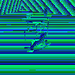

# MagnebotDynamic

`from magnebot.magnebot_dynamic import MagnebotDynamic`

Dynamic data for the Magnebot.

With a [`Magnebot` agent](magnebot.md):

```python
from tdw.controller import Controller
from tdw.tdw_utils import TDWUtils
from magnebot import Magnebot

m = Magnebot(robot_id=0, position={"x": 0.5, "y": 0, "z": -1})
c = Controller()
c.add_ons.append(m)
c.communicate(TDWUtils.create_empty_room(12, 12))
print(m.dynamic.transform.position)
c.communicate({"$type": "terminate"})
```

With a single-agent [`MagnebotController`](magnebot_controller.md):

```python
from magnebot import MagnebotController

m = MagnebotController()
m.init_scene()
print(m.magnebot.dynamic.transform.position)
m.end()
```

***

## Class Variables

| Variable | Type | Description |
| --- | --- | --- |
| `NON_MOVING` | float | If the joint moved by less than this angle or distance since the previous frame, it's considered to be non-moving. |

***

## Fields

- `transform` The Transform data for this robot.

- `joints` A dictionary of [dynamic joint data](joint_dynamic.md). Key = The ID of the joint.

- `immovable` If True, this robot is immovable.

- `collisions_with_objects` A dictionary of collisions between one of this robot's [body parts (joints or non-moving)](robot_static.md) and another object.

- `collisions_with_self` A dictionary of collisions between two of this robot's [body parts](robot_static.md).

- `collisions_with_environment` A dictionary of collisions between one of this robot's [body parts](robot_static.md) and the environment (floors, walls, etc.).

- `held` A dictionary of object IDs currently held by the Magnebot. Key = The arm. Value = a numpy array of object IDs.

- `top` The position of the point at the top of the Magnebot's column.

- `images` The images rendered by the robot as dictionary. Key = the name of the pass. Value = the pass as a numpy array.

| Pass | Image | Description |
| --- | --- | --- |
| `"img"` |  | The rendered image. |
| `"id"` |  | The object color segmentation pass. See `Magnebot.segmentation_color_to_id` and `Magnebot.objects_static` to map segmentation colors to object IDs. |
| `"depth"` |  | The depth values per pixel as a numpy array. Depth values are encoded into the RGB image; see `SceneState.get_depth_values()`. Use the camera matrices to interpret this data. |

- `projection_matrix` The [camera projection matrix](https://github.com/threedworld-mit/tdw/blob/master/Documentation/api/output_data.md#cameramatrices) of the Magnebot's camera as a numpy array.

- `camera_matrix` The [camera matrix](https://github.com/threedworld-mit/tdw/blob/master/Documentation/api/output_data.md#cameramatrices) of the Magnebot's camera as a numpy array.

- `frame_count` The current frame count. This is used for image filenames.

***

## Functions

#### \_\_init\_\_

**`MagnebotDynamic()`**

A dictionary of object IDs currently held by the Magnebot. Key = The arm. Value = a numpy array of object IDs.

#### save_images

**`self.save_images(output_directory)`**

Save the ID pass (segmentation colors) and the depth pass to disk.
Images will be named: `[frame_number]_[pass_name].[extension]`
For example, the depth pass on the first frame will be named: `00000000_depth.png`

The `img` pass is either a .jpg. The `id` and `depth` passes are .png files.

| Parameter | Type | Default | Description |
| --- | --- | --- | --- |
| output_directory |  Union[str, Path] |  | The directory that the images will be saved to. |

#### get_pil_images

**`self.get_pil_images()`**

Convert each image pass from the robot camera to PIL images.

_Returns:_  A dictionary of PIL images. Key = the pass name (img, id, depth); Value = The PIL image (can be None)

#### get_depth_values

**`self.get_depth_values()`**

Convert the depth pass to depth values. Can be None if there is no depth image data.

_Returns:_  A decoded depth pass as a numpy array of floats.

#### get_point_cloud

**`self.get_point_cloud()`**

Returns a point cloud from the depth pass. Can be None if there is no depth image data.

_Returns:_  A decoded depth pass as a numpy array of floats.

