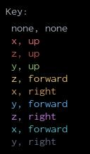
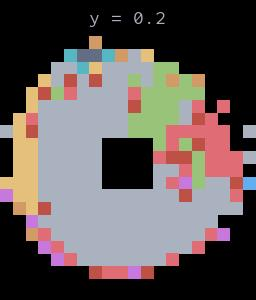

# Arm Articulation

## Inverse Kinematics

Two of the Magnebot's arm articulation actions, `reach_for()` and `move_by()`, use an inverse kinematics (IK) solver. [This is the IK solver.](https://github.com/alters-mit/ikpy) It's a fork of [this repo](https://github.com/Phylliade/ikpy) with better support for prismatic joints.

The `reach_for()` and `move_by()` actions have optional `target_orientation` and `orientation_mode` parameters. `target_orientation` is the directional vector the Magnebot's magnet should align with, and `orientation_mode` is the referential vector. [For more information, read this.](https://notebook.community/Phylliade/ikpy/tutorials/Orientation) 

If `orientation_mode` and `target_orientation` are set to `none`, the solver will use the "full" referential frame, which is typically the most "normal" looking motion (the arm will extend towards the target). However, these are not typically the *best* orientation parameters; an IK action might fail with one set of orientation parameters and succeed with another: 

```python
from magnebot import TestController, Arm
from magnebot.ik.target_orientation import TargetOrientation
from magnebot.ik.orientation_mode import OrientationMode

m = TestController()
m.init_scene()
m.add_camera(position={"x": 0.6, "y": 1.6, "z": 1.6})
target = {"x": 0.2, "y": 0.5, "z": 0.5}
# Use default orientation parameters (auto, auto).
m.reach_for(target=target, arm=Arm.left)
m.reset_arm(arm=Arm.left)
# Explicitly set orientation parameters. The motion will be very different!
m.reach_for(target=target, arm=Arm.left,
            target_orientation=TargetOrientation.right, orientation_mode=OrientationMode.y)
m.end()
```

### Automatic IK orientation solver

By default, `target_orientation=TargetOrientation.auto` and `orientation_mode=OrientationMode.auto`: 

```python
from magnebot import TestController, Arm

m = TestController()
m.init_scene()
# Use default orientation parameters (auto, auto).
target = {"x": 0.2, "y": 0.5, "z": 0.5}
m.reach_for(target=target, arm=Arm.left)
```

This means that the Magnebot will automatically choose an orientation solution, given the target position. It does this by comparing the target position to an array of pre-calculated positions and orientations. The positions and orientations were pre-calculated using `ik_solution.py` which can be found in the `util/` directory of this repo. 

The script `ik_images.py` (also located in `util/`) will generate images of vertical slices of the orientation solutions, which can be found [here](https://github.com/alters-mit/magnebot/tree/master/doc/images/ik).

  

### Accuracy and performance

We've benchmarked the IK orientation solver using `controllers/tests/benchmark/ik.py`. In this test controller, the Magnebot will `reach_for()` an array of target positions and record whether the outcome of the action was guessed correctly. A correct guess is an action that returns `success` or `cannot_reach`. If the action returns `cannot_reach`, this means that the solver knew ahead of time that the action was going to fail and the Magnebot never tried to bend its arm, rather than reaching for an impossible target. If the action returns `failed_to_bend`, this counts as a failure; the Magnebot tried to reach for a position that the solver guessed was reachable, but failed to arrive at the target.

| Action                                                       | Accuracy | Total time elapsed   |
| ------------------------------------------------------------ | -------- | -------------------- |
| `reach_for(target, arm)`                                     | 85.5%    | 2 minutes 19 seconds |
| `reach_for(target, arm, TargetOrientation.none, OrientationMode.none)` | 58.5%    | 2 minutes 42 seconds |
| `reach_for(target, arm)` (up to 5 consecutive attempts; see below) | 88.5%    | 3 minutes 39 seconds |
| Multiple consecutive attempts with a mix of parameters (see below) | 87.5%    | 2 minutes 34 seconds |

### Making multiple attempts

You can slightly improve the accuracy of an IK action by making multiple attempts with different orientation parameters. This will be somewhat slower than using just one action:

```python
from typing import Dict
from magnebot import Magnebot, ActionStatus, Arm
from magnebot.ik.orientation_mode import OrientationMode
from magnebot.ik.target_orientation import TargetOrientation

class MultipleAttempts(Magnebot):
    def reach_for_multi(self, target: Dict[str, float], arm: Arm) -> ActionStatus:
        # Try (auto, auto).
        status = self.reach_for(target=target, arm=arm)
        # Stop if the action succeeded or if we know it's going to fail.
        if status == ActionStatus.success or status == ActionStatus.cannot_reach:
            return status
        # Try (none, none).
        else:
            return self.reach_for(target=target, arm=arm,
                                  target_orientation=TargetOrientation.none,
                                  orientation_mode=OrientationMode.none)
```

### Limitations to the IK orientation solver

- The Magnebot IK orientation solver assumes that the Magnebot's arms are in their neutral position. If they're at any other position, the IK solution found using `auto`, `auto` parameters will be inaccurate. You can reset the arms to their neutral positions with the `reset_arm()` function.
- The IK solver doesn't (and can't) automatically handle situations where there are obstructions such as walls, other objects, objects held by a magnet, or the Magnebot's body.

### Explicitly setting IK orientation parameters

You can explicitly set the `target_orientation` and `orientation_mode` parameters in the `reach_for()` and `grasp()` action. You might want to do this if:

- You want to try different orientations to move the arm around an obstruction.
- You want to train the Magnebot using different orientations (which might be more accurate than the default `auto` approach).
- You need to the Magnebot to pick up an object at a particular angle.

Some guidelines regarding the orientation parameters:

- For a complete list of enum values for `TargetOrientation` and `OrientationMode`, read [this](api/target_orientation.md) and [this](api/orientation_mode.md).
- Both parameters must be `auto` or neither.
- Both parameters must be `none` or neither.
- Setting both parameters to `none` will usually make the arm bend in the most "direct" path.

### Setting the `arrived_at` parameter

The `arrived_at` parameter in the `reach_for()` action determines minimum distance from the magnet to the target. The action immediately stops if the magnet is within this distance. Increasing `arrived_at` therefore "improves" the success rate of an IK action.

### Other miscellaneous notes:

- If the orientation parameters are (`auto`, `auto`), the the target orientation mode is selected via the function `self._get_ik_orientation()`. This function has been highly optimized: on average, it requires 0.002 seconds to run.
- The IK orientation solver will guess ahead of time whether there is any solution. We've compared this guess to whether the Magnebot can in fact reach the target and found it guesses correctly 97.5% of the time.

## Defining your own arm articulation action

You can define your own action that uses inverse kinematics by calling the hidden function `self._start_ik()`. For example implementation, see `controllers/examples/custom_api.py` which adds a `push()` action. For documentation, read the docstring for `_start_ik()` in `magnebot_controller.py`.

Other useful functions:

- `self._do_arm_motion()` will loop until the joints stop moving. If your action only involves a few specific joints, the action will generally run faster if you supply a `joint_ids` parameter.
- `self._append_ik_commands()` converts a list of angles to TDW commands. Unlike `_start_ik()`, it doesn't actually plot an IK solution.

## Getting a target position for `grasp()`

In the `grasp()` action, the Magnebot needs to pick a target position on the surface of the object. The target is determined in `self._get_grasp_target()`.

- The Magnebot gets the side on the object closest to the Magnet using [`Bounds` data](https://github.com/threedworld-mit/tdw/blob/master/Documentation/api/output_data.md#Bounds) in the function `self._get_nearest_side()`
  - If the object is above the magnet, the Magnebot will ignore the lowest side (i.e. the base of the object), since that's usually impossible to reach.
- The Magnebot [raycasts](https://github.com/threedworld-mit/tdw/blob/master/Documentation/api/output_data.md#Raycast) from the Magnet to that position on the bounds. If the raycast hits the target, the Magnebot opts for the raycast position instead (which is usually tighter-fitting to the actual geometry of the object). The raycast might fail if there is an object in the way.

## Debug mode

If `self._debug == True`, then `recach_for()`, `grasp()`, and any other custom action that calls `self._start_ik()` will create a plot of the IK solution. This doesn't work on remote servers.