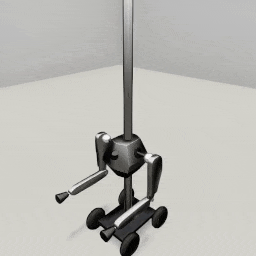

##### Action

# Arm articulation actions

Arm articulation actions are handled by one of two subclasses:

- [`ArmMotion`](../../api/actions/arm_motion.md), a subclass of [`Action`](../../api/actions/action.md). `Drop` and `ResetArm` are subclasses of `ArmMotion`.
- [`IKMotion`](../../api/actions/ik_motion.md), a subclass of `ArmMotion`. `ReachFor` and `Grasp` are subclasses of `IKMotion`.

`ArmMotion` adds the following hidden fields (these are meant to be accessible only within `ArmMotion` and subclasses of `ArmMotion`):

| Field                           | Description               |
| ------------------------------- | ------------------------- |
| [`self._arm`](../../api/arm.md) | The arm doing the motion. |

`ArmMotion` modifies the following functions:

| Function                      | Addition                                                     |
| ----------------------------- | ------------------------------------------------------------ |
| `__init__` (constructor)      | Adds [`arm`](../../api/arm.md) parameter                     |
| `get_initialization_commands` | Make the Magnebot immovable if it's currently moveable       |
| `get_end_commands`            | Add commands to stop the arm's joints at their current positions |

`ArmMotion` adds the following hidden helper functions:

| Function                                                     | Description                                                  |
| ------------------------------------------------------------ | ------------------------------------------------------------ |
| `_joints_are_moving(static: MagnebotStatic, dynamic: MagnebotDynamic)` | Returns true if any of the arm's joints (including the column and torso) are moving. Final (cannot be overridden). |

## Joints and commands

To determine which commands to use with which commands, refer to this table:

| Joint            | Command                | Type               | Units                                                        |
| ---------------- | ---------------------- | ------------------ | ------------------------------------------------------------ |
| `column`         | `set_revolute_target`  | float              | Angle in degreees                                            |
| `torso`          | `set_prismatic_target` | float              | Prismatic position. See: `self.__y_position_to_torso_position(y_position)` |
| `shoulder_left`  | `set_spherical_target` | x, y, z dictionary | Angles in degrees                                            |
| `shoulder_right` | `set_spherical_target` | x, y, z dictionary | Angles in degrees                                            |
| `elbow_left`     | `set_revolute_target`  | float              | Angles in degrees                                            |
| `elbow_right`    | `set_revolute_target`  | float              | Angles in degrees                                            |
| `wrist_left`     | `set_spherical_target` | x, y, z dictionary | Angles in degrees                                            |
| `wrist_right`    | `set_spherical_target` | x, y, z dictionary | Angles in degrees                                            |

## `RaiseArm` action

We'll define an action that raises the arm of the Magenbot.

- We'll set the joint targets in `get_initialization_commands`
- We'll check if the joints are still moving in `get_ongoing_commands`

```python
from typing import List
from magnebot.magnebot_static import MagnebotStatic
from magnebot.magnebot_dynamic import MagnebotDynamic
from magnebot.arm import Arm
from magnebot.arm_joint import ArmJoint
from magnebot.image_frequency import ImageFrequency
from magnebot.action_status import ActionStatus
from magnebot.actions.arm_motion import ArmMotion


class RaiseArm(ArmMotion):
    def get_initialization_commands(self, resp: List[bytes], static: MagnebotStatic, dynamic: MagnebotDynamic,
                                    image_frequency: ImageFrequency) -> List[dict]:
        commands = super().get_initialization_commands(resp=resp, static=static, dynamic=dynamic,
                                                       image_frequency=image_frequency)
        if self._arm == Arm.left:
            shoulder_id = static.arm_joints[ArmJoint.shoulder_left]
            elbow_id = static.arm_joints[ArmJoint.elbow_left]
            wrist_id = static.arm_joints[ArmJoint.wrist_left]
        else:
            shoulder_id = static.arm_joints[ArmJoint.shoulder_right]
            elbow_id = static.arm_joints[ArmJoint.elbow_right]
            wrist_id = static.arm_joints[ArmJoint.wrist_right]
        commands.extend([{"$type": "set_spherical_target",
                          "joint_id": shoulder_id,
                          "target": {"x": -179, "y": 0, "z": 0},
                          "id": static.robot_id},
                         {"$type": "set_revolute_target",
                          "joint_id": elbow_id,
                          "target": 0,
                          "id": static.robot_id},
                         {"$type": "set_spherical_target",
                          "joint_id": wrist_id,
                          "target": {"x": 0, "y": 0, "z": 0},
                          "id": static.robot_id}])
        return commands

    def get_ongoing_commands(self, resp: List[bytes], static: MagnebotStatic, dynamic: MagnebotDynamic) -> List[dict]:
        if not self._joints_are_moving(static=static, dynamic=dynamic):
            self.status = ActionStatus.success
        return []
```

...And that's it! Now we need to add it to a `Magnebot` subclass and then a controller. We'll also add a [third-person camera](../magnebot/third_person_camera.md) to view our action:

```python
from typing import List
from tdw.controller import Controller
from tdw.tdw_utils import TDWUtils
from tdw.add_ons.third_person_camera import ThirdPersonCamera
from tdw.add_ons.image_capture import ImageCapture
from tdw.backend.paths import EXAMPLE_CONTROLLER_OUTPUT_PATH
from magnebot.magnebot import Magnebot
from magnebot.magnebot_static import MagnebotStatic
from magnebot.magnebot_dynamic import MagnebotDynamic
from magnebot.arm import Arm
from magnebot.arm_joint import ArmJoint
from magnebot.image_frequency import ImageFrequency
from magnebot.action_status import ActionStatus
from magnebot.actions.arm_motion import ArmMotion
from magnebot.util import get_default_post_processing_commands


class RaiseArm(ArmMotion):
    def get_initialization_commands(self, resp: List[bytes], static: MagnebotStatic, dynamic: MagnebotDynamic,
                                    image_frequency: ImageFrequency) -> List[dict]:
        commands = super().get_initialization_commands(resp=resp, static=static, dynamic=dynamic,
                                                       image_frequency=image_frequency)
        if self._arm == Arm.left:
            shoulder_id = static.arm_joints[ArmJoint.shoulder_left]
            elbow_id = static.arm_joints[ArmJoint.elbow_left]
            wrist_id = static.arm_joints[ArmJoint.wrist_left]
        else:
            shoulder_id = static.arm_joints[ArmJoint.shoulder_right]
            elbow_id = static.arm_joints[ArmJoint.elbow_right]
            wrist_id = static.arm_joints[ArmJoint.wrist_right]
        commands.extend([{"$type": "set_spherical_target",
                          "joint_id": shoulder_id,
                          "target": {"x": -179, "y": 0, "z": 0},
                          "id": static.robot_id},
                         {"$type": "set_revolute_target",
                          "joint_id": elbow_id,
                          "target": 0,
                          "id": static.robot_id},
                         {"$type": "set_spherical_target",
                          "joint_id": wrist_id,
                          "target": {"x": 0, "y": 0, "z": 0},
                          "id": static.robot_id}])
        return commands

    def get_ongoing_commands(self, resp: List[bytes], static: MagnebotStatic, dynamic: MagnebotDynamic) -> List[dict]:
        if not self._joints_are_moving(static=static, dynamic=dynamic):
            self.status = ActionStatus.success
        return []


class MyMagnebot(Magnebot):
    def raise_arm(self, arm: Arm) -> None:
        self.action = RaiseArm(arm=arm)


if __name__ == "__main__":
    c = Controller()
    magnebot = MyMagnebot()
    camera = ThirdPersonCamera(position={"x": -1.1, "y": 1.7, "z": 1.2},
                               look_at=magnebot.robot_id,
                               avatar_id="a")
    path = EXAMPLE_CONTROLLER_OUTPUT_PATH.joinpath("raise_arm")
    print(f"Images will be saved to: {path}")
    capture = ImageCapture(avatar_ids=["a"], path=path)
    c.add_ons.extend([magnebot, camera, capture])
    commands = [{"$type": "load_scene",
                 "scene_name": "ProcGenScene"},
                TDWUtils.create_empty_room(12, 12)]
    commands.extend(get_default_post_processing_commands())
    c.communicate(commands)
    magnebot.raise_arm(arm=Arm.right)
    while magnebot.action.status == ActionStatus.ongoing:
        c.communicate([])
    c.communicate([])
    c.communicate({"$type": "terminate"})
```

Result:




***

**Next: [Inverse kinematics (IK) actions](ik.md)**

[Return to the README](../../../README.md)

***

Example controllers:

- [raise_arm.py](https://github.com/alters-mit/magnebot/blob/main/controllers/examples/actions/raise_arm.py) An example RaiseArm arm articulation action.

