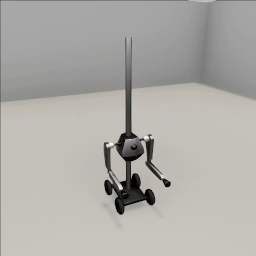

##### Action

# Inverse kinematics (IK) actions

Inverse kinematic (IK) solvers are used in the [`ReachFor`](../../api/actions/reach_for.md) and  [`Grasp`](../../api/actions/grasp.md) actions. Each of the Magnebot's arms is abstracted as an IK chain that can reach for a target position.

IK actions often involve several steps and are thus relatively difficult to program.

IK actions used the [`IKMotion`](../../api/actions/ik_motion.md) abstract class, a subclass of [`ArmMotion`](../../api/actions/arm_motion.md) (which in turn is a subclass of [`Action`](../../api/actions/action.md)).

`IKMotion` adds the following hidden fields (these are meant to be accessible only within `IKMotion` and subclasses of `IKMotion`):

| Field                             | Description                                                  |
| --------------------------------- | ------------------------------------------------------------ |
| [`self._arm`](../../api/arm.md)   | The arm doing the motion. *(Inherited from `ArmMotion`)*     |
| `self._auto_orientation`          | Boolean. True if the action will try to gather a list of viable orientations, False orientation parameters have been explicitly defined |
| `self._orientations`              | A list of [`Orientation`](../../api/ik/orientation.md) parameters to try |
| `self._orientation_index`         | The current index in `self._orientations`                    |
| `self._arm_articulation_commands` | A list of lists of commands for the IK motion (see below).   |
| `self._slide_torso`               | If True, the torso is currently sliding (prior to the rest of the IK motion) |

`IKMotion` modifies the following functions:

| Function                      | Addition                                                     |
| ----------------------------- | ------------------------------------------------------------ |
| `__init__` (constructor)      | Adds [`arm`](../../api/arm.md) parameter *(Inherited from `ArmMotion`)*<br>Adds [`orientation_mode`](../../api/ik/orientation_mode.md) parameter<br>Adds [`target_orientation`](../../api/ik/target_orientation.md) parameter<br>Adds [`dynamic`](../../api/magnebot_dynamic.md) parameter |
| `get_initialization_commands` | Make the Magnebot immovable if it's currently moveable *(Inherited from `ArmMotion`)* |
| `get_end_commands`            | Add commands to stop the arm's joints at their current positions *(Inherited from `ArmMotion`)* |

`IKMotion` adds the following hidden helper functions that you'll likely need to add to your custom IK action:

| Function                                                     | Description                                                  |
| ------------------------------------------------------------ | ------------------------------------------------------------ |
| `_joints_are_moving(static: MagnebotStatic, dynamic: MagnebotDynamic)` | Returns true if any of the arm's joints (including the column and torso) are moving. Final (cannot be overridden).  *(Inherited from `ArmMotion`)* |
| `_set_start_arm_articulation_commands(static: MagnebotStatic, dynamic: MagnebotDynamic, arrived_at: float = 0.125)` | Sets the list of commands for arm articulation (see below).  |
| `_evaluate_arm_articulation(resp: List[bytes], static: MagnebotStatic, dynamic: MagnebotDynamic)` | Add this to `get_ongoing_commands` to evaulate the state of the IK motion. Returns a list of commands. May set `self.status` if the motion is complete. |

`IKMotion` adds the following hidden helper functions that are called internally; it's unlikely you'll need to call these in a custom action: 

| Function                                                     | Description                                                  |
| ------------------------------------------------------------ | ------------------------------------------------------------ |
| `_get_ik_orientations(target: np.array, arm: Arm)`           | Static. Returns a list of [`Orientation`](../../api/ik/orientation.md) settings. The first element in the list is always the best option. This is called internally. |
| `_get_ik_commands(angles: np.array, static: MagnebotStatic)` | Final (cannot be overridden). Converts a list of angles in degrees to joint commands. Returns None. |
| `_get_ik_links(arm: Arm)`                                    | Static. Returns a list of IK links of an arm.                |

`IKMotion` includes the following *abstract* functions.  These functions *must* be overridden or there will be an error:

| Function                                                     | Description                                                  |
| ------------------------------------------------------------ | ------------------------------------------------------------ |
| `_get_ik_target_position()`                                  | Returns the target IK position in a coordinate space relative to the Magnebot's position and rotation. |
| `_is_success(resp: List[bytes], static: MagnebotStatic, dynamic: MagnebotDynamic)` | Returns True if the action was successful.                   |
| `_get_fail_status()`                                         | Returns the [`ActionStatus`](../../api/action_status.md) for when the action fails. |

## The `_set_start_arm_articulation_commands` function

`self._get_ik_target_position()` returns and sets the target position. 

When you call `self._set_start_arm_articulation_commands(static, dynamic)`, it will do the following:

- Get the target position via `self._get_ik_target_position()`
- Get an IK solution; evaluate if the IK solution is likely to fail
- Call `_get_ik_orientations(target, arm)` to select possible orientation parameters
- Call `_get_ik_commands(angles, static)` to convert the IK solution into TDW commands. This will set `self._arm_articulation_commands`, a list of lists of commands.   If the target position is above the Magnebot's torso, the Magnebot will *first* move the torso prismatic joint (the first list of commands), *then* the rest of the IK motion (the second list of commands): `[[slide_torso_commands], [ik_commands]]`. Otherwise, all commands are sent at once: `[[slide_torso_and_ik_commands]]`

## Define an `IKMotion` action

In this example, we'll define a `Push` IK action.

`Push` has three steps:

- Get the centroid of the target object (request `Bounds` output data)
- Slide the torso up or down
- Push the object

This will be handled with an enum:

```python
from enum import Enum

class PushState(Enum):
    getting_bounds = 1
    sliding_torso = 2
    pushing = 4
```

The `Push` action is a subclass of `IKmotion`. It includes a `target` (an object ID) in the constructor. In `get_initialization_commands()`, we'll request `Bounds` output data.

```python
from enum import Enum
from typing import List
import numpy as np
from magnebot import Arm, ImageFrequency
from magnebot.ik.orientation_mode import OrientationMode
from magnebot.ik.target_orientation import TargetOrientation
from magnebot.actions.ik_motion import IKMotion
from magnebot.magnebot_dynamic import MagnebotDynamic
from magnebot.magnebot_static import MagnebotStatic


class PushState(Enum):
    getting_bounds = 1
    sliding_torso = 2
    pushing = 4


class Push(IKMotion):
    def __init__(self, target: int, arm: Arm, dynamic: MagnebotDynamic):
        self.target: int = target
        self.push_state: PushState = PushState.getting_bounds

        # This will be set during get_ongoing_commands()
        self.ik_target_position: np.array = np.array([0, 0, 0])
        self.initial_object_centroid: np.array = np.array([0, 0, 0])
        self.initial_object_position: np.array = np.array([0, 0, 0])

        super().__init__(arm=arm,
                         orientation_mode=OrientationMode.x,
                         target_orientation=TargetOrientation.up,
                         dynamic=dynamic)

    def get_initialization_commands(self, resp: List[bytes], static: MagnebotStatic, dynamic: MagnebotDynamic,
                                    image_frequency: ImageFrequency) -> List[dict]:
        commands = super().get_initialization_commands(resp=resp,
                                                       static=static,
                                                       dynamic=dynamic,
                                                       image_frequency=image_frequency)
        # Request bounds data.
        commands.append({"$type": "send_bounds",
                         "frequency": "once"})
        return commands
```

The bulk of the action is handled in `get_ongoing_commands`. Here, we evaluate the `PushState`:

| State            | Behavior                                                     |
| ---------------- | ------------------------------------------------------------ |
| `getting_bounds` | Set the target position to the centroid of the object.<br>Get the initial position of the object.<br>Start sliding the torso to be above the target object. |
| `sliding_torso`  | Continue to slide the torso.<br>If the torso is done sliding, set an IK target. The target position is behind the object, relative to the magnet. The magnet will try to move "through" the object and thereby push it. |
| `pushing`        | Continue the push arm motion. When the motion ends, the action ends. |

To get the initial position of the object, we'll define a `_get_object_position(resp)` function.

```python
from enum import Enum
from typing import List
import numpy as np
from tdw.output_data import OutputData, Transforms, Bounds
from magnebot import Arm, ArmJoint, ImageFrequency
from magnebot.ik.orientation_mode import OrientationMode
from magnebot.ik.target_orientation import TargetOrientation
from magnebot.actions.ik_motion import IKMotion
from magnebot.magnebot_dynamic import MagnebotDynamic
from magnebot.magnebot_static import MagnebotStatic


class PushState(Enum):
    getting_bounds = 1
    sliding_torso = 2
    pushing = 4


class Push(IKMotion):
    def __init__(self, target: int, arm: Arm, dynamic: MagnebotDynamic):
        self.target: int = target
        self.push_state: PushState = PushState.getting_bounds

        # This will be set during get_ongoing_commands()
        self.ik_target_position: np.array = np.array([0, 0, 0])
        self.initial_object_centroid: np.array = np.array([0, 0, 0])
        self.initial_object_position: np.array = np.array([0, 0, 0])

        super().__init__(arm=arm,
                         orientation_mode=OrientationMode.x,
                         target_orientation=TargetOrientation.up,
                         dynamic=dynamic)

    def get_initialization_commands(self, resp: List[bytes], static: MagnebotStatic, dynamic: MagnebotDynamic,
                                    image_frequency: ImageFrequency) -> List[dict]:
        commands = super().get_initialization_commands(resp=resp,
                                                       static=static,
                                                       dynamic=dynamic,
                                                       image_frequency=image_frequency)
        # Request bounds data.
        commands.append({"$type": "send_bounds",
                         "frequency": "once"})
        return commands

    def get_ongoing_commands(self, resp: List[bytes], static: MagnebotStatic, dynamic: MagnebotDynamic) -> List[dict]:
        # Use the bounds data to get the position of the object.
        if self.push_state == PushState.getting_bounds:
            # Get the initial centroid of the object and its initial position.
            for i in range(len(resp) - 1):
                r_id = OutputData.get_data_type_id(resp[i])
                if r_id == "boun":
                    bounds = Bounds(resp[i])
                    for j in range(bounds.get_num()):
                        if bounds.get_id(j) == self.target:
                            self.initial_object_centroid = bounds.get_center(j)
                            break
            self.initial_object_position = self._get_object_position(resp=resp)
            # Slide the torso up and above the target object.
            torso_position = self.initial_object_centroid[1] + 0.1
            # Convert the torso position from meters to prismatic joint position.
            torso_position = self._y_position_to_torso_position(torso_position)
            # Start sliding the torso.
            self.push_state = PushState.sliding_torso
            return [{"$type": "set_prismatic_target",
                     "id": static.robot_id,
                     "joint_id": static.arm_joints[ArmJoint.torso],
                     "target": torso_position}]
        # Slide the torso.
        elif self.push_state == PushState.sliding_torso:
            # Continue to slide the torso.
            if self._joints_are_moving(static=static, dynamic=dynamic):
                return []
            # Push the object.
            else:
                magnet_position = dynamic.joints[static.magnets[self.arm]].position
                # Get a position opposite the center of the object from the magnet.
                v = magnet_position - self.initial_object_centroid
                v = v / np.linalg.norm(v)
                target_position = self.initial_object_centroid - (v * 0.1)
                # Convert the position to relative coordinates.
                self.ik_target_position = self._absolute_to_relative(position=target_position, dynamic=dynamic)
                # Start the IK motion.
                self._set_start_arm_articulation_commands(static=static, dynamic=dynamic)
                self.push_state = PushState.pushing
                return self._evaluate_arm_articulation(resp=resp, static=static, dynamic=dynamic)
        # Continue to push.
        elif self.push_state == PushState.pushing:
            return self._evaluate_arm_articulation(resp=resp, static=static, dynamic=dynamic)
        else:
            raise Exception(f"Not defined: {self.push_state}")
        
    def _get_object_position(self, resp: List[bytes]) -> np.array:
        for i in range(len(resp) - 1):
            r_id = OutputData.get_data_type_id(resp[i])
            if r_id == "tran":
                transforms = Transforms(resp[i])
                for j in range(transforms.get_num()):
                    if transforms.get_id(j) == self.target:
                        return transforms.get_position(j)
        raise Exception()
```

Now, we need to define the abstract helper functions in order to complete the `Push` action:

- The target IK position is `self.ik_target_position` (set in `get_ongoing_commands` while the state is `getting_bounds`)
- The action is a success if the object is no longer in its initial position.
- The fail status is `ActionStatus.failed_to_move`

```python
from enum import Enum
from typing import List
import numpy as np
from tdw.output_data import OutputData, Transforms, Bounds
from magnebot import ActionStatus, Arm, ArmJoint, ImageFrequency
from magnebot.ik.orientation_mode import OrientationMode
from magnebot.ik.target_orientation import TargetOrientation
from magnebot.actions.ik_motion import IKMotion
from magnebot.magnebot_dynamic import MagnebotDynamic
from magnebot.magnebot_static import MagnebotStatic


class PushState(Enum):
    getting_bounds = 1
    sliding_torso = 2
    pushing = 4


class Push(IKMotion):
    def __init__(self, target: int, arm: Arm, dynamic: MagnebotDynamic):
        """
        :param target: The target object ID.
        :param arm: The arm used for this action.
        :param dynamic: The dynamic Magnebot data.
        """

        self.target: int = target
        self.push_state: PushState = PushState.getting_bounds

        # This will be set during get_ongoing_commands()
        self.ik_target_position: np.array = np.array([0, 0, 0])
        self.initial_object_centroid: np.array = np.array([0, 0, 0])
        self.initial_object_position: np.array = np.array([0, 0, 0])

        super().__init__(arm=arm,
                         orientation_mode=OrientationMode.x,
                         target_orientation=TargetOrientation.up,
                         dynamic=dynamic)

    def get_initialization_commands(self, resp: List[bytes], static: MagnebotStatic, dynamic: MagnebotDynamic,
                                    image_frequency: ImageFrequency) -> List[dict]:
        commands = super().get_initialization_commands(resp=resp,
                                                       static=static,
                                                       dynamic=dynamic,
                                                       image_frequency=image_frequency)
        # Request bounds data.
        commands.append({"$type": "send_bounds",
                         "frequency": "once"})
        return commands

    def get_ongoing_commands(self, resp: List[bytes], static: MagnebotStatic, dynamic: MagnebotDynamic) -> List[dict]:
        # Use the bounds data to get the position of the object.
        if self.push_state == PushState.getting_bounds:
            # Get the initial centroid of the object and its initial position.
            for i in range(len(resp) - 1):
                r_id = OutputData.get_data_type_id(resp[i])
                if r_id == "boun":
                    bounds = Bounds(resp[i])
                    for j in range(bounds.get_num()):
                        if bounds.get_id(j) == self.target:
                            self.initial_object_centroid = bounds.get_center(j)
                            break
            self.initial_object_position = self._get_object_position(resp=resp)
            # Slide the torso up and above the target object.
            torso_position = self.initial_object_centroid[1] + 0.1
            # Convert the torso position from meters to prismatic joint position.
            torso_position = self._y_position_to_torso_position(torso_position)
            # Start sliding the torso.
            self.push_state = PushState.sliding_torso
            return [{"$type": "set_prismatic_target",
                     "id": static.robot_id,
                     "joint_id": static.arm_joints[ArmJoint.torso],
                     "target": torso_position}]
        # Slide the torso.
        elif self.push_state == PushState.sliding_torso:
            # Continue to slide the torso.
            if self._joints_are_moving(static=static, dynamic=dynamic):
                return []
            # Push the object.
            else:
                magnet_position = dynamic.joints[static.magnets[self.arm]].position
                # Get a position opposite the center of the object from the magnet.
                v = magnet_position - self.initial_object_centroid
                v = v / np.linalg.norm(v)
                target_position = self.initial_object_centroid - (v * 0.1)
                # Convert the position to relative coordinates.
                self.ik_target_position = self._absolute_to_relative(position=target_position, dynamic=dynamic)
                # Start the IK motion.
                self._set_start_arm_articulation_commands(static=static, dynamic=dynamic)
                self.push_state = PushState.pushing
                return self._evaluate_arm_articulation(resp=resp, static=static, dynamic=dynamic)
        # Continue to push.
        elif self.push_state == PushState.pushing:
            return self._evaluate_arm_articulation(resp=resp, static=static, dynamic=dynamic)
        else:
            raise Exception(f"Not defined: {self.push_state}")

    def _get_object_position(self, resp: List[bytes]) -> np.array:
        for i in range(len(resp) - 1):
            r_id = OutputData.get_data_type_id(resp[i])
            if r_id == "tran":
                transforms = Transforms(resp[i])
                for j in range(transforms.get_num()):
                    if transforms.get_id(j) == self.target:
                        return transforms.get_position(j)
        raise Exception()

    def _get_ik_target_position(self) -> np.array:
        return self.ik_target_position

    def _is_success(self, resp: List[bytes], static: MagnebotStatic, dynamic: MagnebotDynamic) -> bool:
        target_position = self._get_object_position(resp=resp)
        return np.linalg.norm(self.initial_object_position - target_position) > 0.1

    def _get_fail_status(self) -> ActionStatus:
        return ActionStatus.failed_to_move
```

Finally, we'll define a `PushController`. Notice that unlike previous examples of how to implement actions, we're not defining a subclass of `Magnebot`. This is mostly for the sake of brevity; in this case, we can manually set the `Push` action.

In this controller, the Magnebot will move towards the target object (a vase on top of a trunk) and push it.

```python
from enum import Enum
from typing import List
import numpy as np
from tdw.controller import Controller
from tdw.tdw_utils import TDWUtils
from tdw.add_ons.third_person_camera import ThirdPersonCamera
from tdw.output_data import OutputData, Transforms, Bounds
from magnebot import Magnebot, ActionStatus, Arm, ArmJoint, ImageFrequency
from magnebot.ik.orientation_mode import OrientationMode
from magnebot.ik.target_orientation import TargetOrientation
from magnebot.actions.ik_motion import IKMotion
from magnebot.magnebot_dynamic import MagnebotDynamic
from magnebot.magnebot_static import MagnebotStatic


class PushState(Enum):
    getting_bounds = 1
    sliding_torso = 2
    pushing = 4


class Push(IKMotion):
    def __init__(self, target: int, arm: Arm, dynamic: MagnebotDynamic):
        self.target: int = target
        self.push_state: PushState = PushState.getting_bounds

        # This will be set during get_ongoing_commands()
        self.ik_target_position: np.array = np.array([0, 0, 0])
        self.initial_object_centroid: np.array = np.array([0, 0, 0])
        self.initial_object_position: np.array = np.array([0, 0, 0])

        super().__init__(arm=arm,
                         orientation_mode=OrientationMode.x,
                         target_orientation=TargetOrientation.up,
                         dynamic=dynamic)

    def get_initialization_commands(self, resp: List[bytes], static: MagnebotStatic, dynamic: MagnebotDynamic,
                                    image_frequency: ImageFrequency) -> List[dict]:
        commands = super().get_initialization_commands(resp=resp,
                                                       static=static,
                                                       dynamic=dynamic,
                                                       image_frequency=image_frequency)
        # Request bounds data.
        commands.append({"$type": "send_bounds",
                         "frequency": "once"})
        return commands

    def get_ongoing_commands(self, resp: List[bytes], static: MagnebotStatic, dynamic: MagnebotDynamic) -> List[dict]:
        # Use the bounds data to get the position of the object.
        if self.push_state == PushState.getting_bounds:
            # Get the initial centroid of the object and its initial position.
            for i in range(len(resp) - 1):
                r_id = OutputData.get_data_type_id(resp[i])
                if r_id == "boun":
                    bounds = Bounds(resp[i])
                    for j in range(bounds.get_num()):
                        if bounds.get_id(j) == self.target:
                            self.initial_object_centroid = bounds.get_center(j)
                            break
            self.initial_object_position = self._get_object_position(resp=resp)
            # Slide the torso up and above the target object.
            torso_position = self.initial_object_centroid[1] + 0.1
            # Convert the torso position from meters to prismatic joint position.
            torso_position = self._y_position_to_torso_position(torso_position)
            # Start sliding the torso.
            self.push_state = PushState.sliding_torso
            return [{"$type": "set_prismatic_target",
                     "id": static.robot_id,
                     "joint_id": static.arm_joints[ArmJoint.torso],
                     "target": torso_position}]
        # Slide the torso.
        elif self.push_state == PushState.sliding_torso:
            # Continue to slide the torso.
            if self._joints_are_moving(static=static, dynamic=dynamic):
                return []
            # Push the object.
            else:
                magnet_position = dynamic.joints[static.magnets[self.arm]].position
                # Get a position opposite the center of the object from the magnet.
                v = magnet_position - self.initial_object_centroid
                v = v / np.linalg.norm(v)
                target_position = self.initial_object_centroid - (v * 0.1)
                # Convert the position to relative coordinates.
                self.ik_target_position = self._absolute_to_relative(position=target_position, dynamic=dynamic)
                # Start the IK motion.
                self._set_start_arm_articulation_commands(static=static, dynamic=dynamic)
                self.push_state = PushState.pushing
                return self._evaluate_arm_articulation(resp=resp, static=static, dynamic=dynamic)
        # Continue to push.
        elif self.push_state == PushState.pushing:
            return self._evaluate_arm_articulation(resp=resp, static=static, dynamic=dynamic)
        else:
            raise Exception(f"Not defined: {self.push_state}")

    def _get_object_position(self, resp: List[bytes]) -> np.array:
        for i in range(len(resp) - 1):
            r_id = OutputData.get_data_type_id(resp[i])
            if r_id == "tran":
                transforms = Transforms(resp[i])
                for j in range(transforms.get_num()):
                    if transforms.get_id(j) == self.target:
                        return transforms.get_position(j)
        raise Exception()

    def _get_ik_target_position(self) -> np.array:
        return self.ik_target_position

    def _is_success(self, resp: List[bytes], static: MagnebotStatic, dynamic: MagnebotDynamic) -> bool:
        target_position = self._get_object_position(resp=resp)
        return np.linalg.norm(self.initial_object_position - target_position) > 0.1

    def _get_fail_status(self) -> ActionStatus:
        return ActionStatus.failed_to_move


class PushController(Controller):
    def __init__(self, port: int = 1071, check_version: bool = True, launch_build: bool = True):
        super().__init__(port=port, check_version=check_version, launch_build=launch_build)
        self.magnebot: Magnebot = Magnebot()
        self.communicate({"$type": "set_screen_size",
                          "width": 1024,
                          "height": 1024})

    def run(self):
        magnebot = Magnebot(robot_id=0)
        camera = ThirdPersonCamera(position={"x": 1.03, "y": 2, "z": 2.34},
                                   look_at=0,
                                   follow_object=0)
        self.add_ons.extend([magnebot, camera])
        commands = [TDWUtils.create_empty_room(12, 12)]
        trunck_id = self.get_unique_id()
        vase_id = self.get_unique_id()
        commands.extend(self.get_add_physics_object(model_name="trunck",
                                                    position={"x": -2.133, "y": 0, "z": 2.471},
                                                    rotation={"x": 0, "y": -29, "z": 0},
                                                    scale_factor={"x": 1, "y": 0.8, "z": 1},
                                                    default_physics_values=False,
                                                    kinematic=True,
                                                    object_id=trunck_id))
        commands.extend(self.get_add_physics_object(model_name="vase_02",
                                                    position={"x": -1.969, "y": 0.794254, "z": 2.336},
                                                    object_id=vase_id))
        self.communicate(commands)
        # Wait for the Magnebot to initialize.
        while magnebot.action.status == ActionStatus.ongoing:
            self.communicate([])
        # Move to the object.
        magnebot.move_to(target=trunck_id, arrived_offset=0.3)
        while magnebot.action.status == ActionStatus.ongoing:
            self.communicate([])

        # Push the vase.
        magnebot.action = Push(target=vase_id, arm=Arm.right, dynamic=magnebot.dynamic)
        while magnebot.action.status == ActionStatus.ongoing:
            self.communicate([])
        print(magnebot.action.status)

        # Back away. Stop moving the camera.
        camera.follow_object = None
        camera.look_at = None
        magnebot.move_by(-0.5)
        while magnebot.action.status == ActionStatus.ongoing:
            self.communicate([])
        # Reset the arms.  
        for arm in [Arm.left, Arm.right]:
            magnebot.reset_arm(arm=arm)
            while magnebot.action.status == ActionStatus.ongoing:
                self.communicate([])
        self.communicate({"$type": "terminate"})


if __name__ == "__main__":
    c = PushController()
    c.run()
```

Result:



***

**Next: [Camera actions](camera.md)**

[Return to the README](../../../README.md)

***

Example controllers:

- [push.py](https://github.com/alters-mit/magnebot/blob/main/controllers/examples/actions/custom_action.py) Define a custom `Push` and use it in a controller.