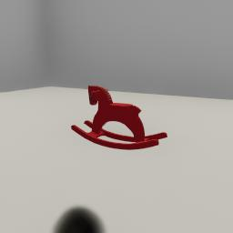
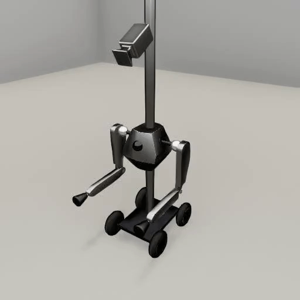

##### Magnebot

# Camera actions

Camera actions require only one `communicate()` call to complete.

## Rotation

`rotate_camera(roll, pitch, yaw)` will rotate the camera by (roll, pitch, yaw) in degrees:

```python
from tdw.controller import Controller
from tdw.tdw_utils import TDWUtils
from magnebot import Magnebot, ActionStatus

c = Controller()
magnebot = Magnebot()
c.add_ons.append(magnebot)
c.communicate([{"$type": "load_scene",
                "scene_name": "ProcGenScene"},
               TDWUtils.create_empty_room(12, 12)])
# Use default orientation parameters (auto, auto).
magnebot.rotate_camera(roll=0, pitch=45, yaw=0)
c.communicate([])
assert magnebot.action.status == ActionStatus.success, magnebot.action.status
# Clamped pitch.
magnebot.rotate_camera(pitch=90)
c.communicate([])
assert magnebot.action.status == ActionStatus.clamped_camera_rotation, magnebot.action.status
c.communicate({"$type": "terminate"})
```

The camera rotation is clamped within a certain range, defined by Euler angles:

```python
from magnebot.actions.rotate_camera import RotateCamera

print(RotateCamera.CAMERA_RPY_CONSTRAINTS)
```

## Look At

Rather than rotating the camera by setting rotational angles, you can look at a target object or position with the `look_at(target)` command. `target` can be either an object ID (an integer), a dictionary (a position), or a numpy array (a position):

```python
from tdw.controller import Controller
from tdw.tdw_utils import TDWUtils
from tdw.backend.paths import EXAMPLE_CONTROLLER_OUTPUT_PATH
from magnebot import Magnebot, ActionStatus

"""
Minimal example of the `look_at(target)` action.
"""

d = EXAMPLE_CONTROLLER_OUTPUT_PATH.joinpath("magnebot_look_at")
if not d.exists():
    d.mkdir(parents=True)
print(f"Images will be saved to: {d}")
c = Controller()
m = Magnebot()
c.add_ons.append(m)
object_id = Controller.get_unique_id()
c.communicate([TDWUtils.create_empty_room(12, 12),
               Controller.get_add_object(model_name="rh10",
                                         position={"x": -1, "y": 0, "z": 2},
                                         object_id=object_id)])
m.look_at(target=object_id)
while m.action.status == ActionStatus.ongoing:
    c.communicate([])
# Add one more `communicate([])` call to let the action end and generate images.
c.communicate([])
# Save the images.
m.dynamic.save_images(output_directory=d)
c.communicate({"$type": "terminate"})
```

Result:



If you call `look_at(target)`, the Magnebot's camera will no longer be clamped by `RotateCamera.CAMERA_RPY_CONSTRAINTS`, meaning that `rotate_camera()` won't work as expected;  you'll need to call `reset_camera()` before calling `rotate_camera()` again.

## Movement

`move_camera(position)` will move the camera to/by a position; by default, it will move the camera by a positional offset:

```python
from tdw.controller import Controller
from tdw.tdw_utils import TDWUtils
from magnebot import Magnebot

c = Controller()
m = Magnebot()
c.add_ons.append(m)
c.communicate(TDWUtils.create_empty_room(12, 12))
c.communicate([])
m.move_camera({"x": 0, "y": 0.6, "z": 0})
c.communicate([])
c.communicate({"$type": "terminate"})
```

## Reset the camera

You can reset the camera to its default position with by calling `reset_camera()`:

```python
from tdw.controller import Controller
from tdw.tdw_utils import TDWUtils
from magnebot import Magnebot

c = Controller()
m = Magnebot()
c.add_ons.append(m)
c.communicate(TDWUtils.create_empty_room(12, 12))
c.communicate([])
m.move_camera({"x": 0, "y": 0.6, "z": 0})
c.communicate([])
m.reset_camera()
c.communicate([])
c.communicate({"$type": "terminate"})
```

Set the optional `position` and `rotation` parameters to reset only the position or rotation:

```python
from tdw.controller import Controller
from tdw.tdw_utils import TDWUtils
from magnebot import Magnebot

c = Controller()
m = Magnebot()
c.add_ons.append(m)
c.communicate(TDWUtils.create_empty_room(12, 12))
c.communicate([])
m.move_camera({"x": 0, "y": 0.6, "z": 0})
c.communicate([])
m.reset_camera(position=True, rotation=False)
c.communicate([])
c.communicate({"$type": "terminate"})
```

## Prevent the camera from moving with the torso

By default, the camera is attached to the Magnebot's torso; when the torso moves, the camera does as well. If you want to manually move the camera via `move_camera(position)`, you might want to parent the camera to the Magnebot's column, which doesn't move. To do so, set `parent_camera_to_torso=False` in the Magnebot constructor:

```python
from tdw.controller import Controller
from tdw.tdw_utils import TDWUtils
from magnebot import Magnebot

c = Controller()
m = Magnebot(parent_camera_to_torso=False)
c.add_ons.append(m)
c.communicate(TDWUtils.create_empty_room(12, 12))
c.communicate([])
m.move_camera({"x": 0, "y": 0.6, "z": 0})
c.communicate([])
c.communicate({"$type": "terminate"})
```

## Visualize the camera

Add a visual mesh to the camera by setting `visual_camera_mesh=True` in the Magnebot constructor. The camera won't have colliders and won't respond to physics.

```python
from tdw.controller import Controller
from tdw.tdw_utils import TDWUtils
from tdw.add_ons.third_person_camera import ThirdPersonCamera
from tdw.add_ons.image_capture import ImageCapture
from tdw.backend.paths import EXAMPLE_CONTROLLER_OUTPUT_PATH
from magnebot import Magnebot, ActionStatus
from magnebot.constants import TORSO_MIN_Y

c = Controller()
m = Magnebot(visual_camera_mesh=True, parent_camera_to_torso=False)
c.add_ons.append(m)
c.communicate(TDWUtils.create_empty_room(12, 12))
c.communicate([])
m.move_camera({"x": 0, "y": 0.6, "z": 0})
c.communicate([])
m.rotate_camera(pitch=30)
while m.action.status == ActionStatus.ongoing:
    c.communicate([])
camera = ThirdPersonCamera(position={"x": -1, "y": 1.6, "z": 1.5},
                           look_at={"x": 0, "y": 0.7, "z": 0},
                           avatar_id="a")
path = EXAMPLE_CONTROLLER_OUTPUT_PATH.joinpath("magnebot_visual_camera")
print(f"Images will be saved to: {path}")
capture = ImageCapture(avatar_ids=["a", m.static.avatar_id], path=path)
c.add_ons.extend([camera, capture])
c.communicate([])
# Slide the torso away from the camera.
m.slide_torso(height=TORSO_MIN_Y)
while m.action.status == ActionStatus.ongoing:
    c.communicate([])
c.communicate({"$type": "terminate"})
```

Result:



***

**Next: [Third-person cameras](third_person_camera.md)**

[Return to the README](../../../README.md)

***

Examples controllers:

- [look_at.py](https://github.com/alters-mit/magnebot/blob/main/controllers/examples/magnebot/look_at.py) Minimal example of the `look_at(target)` action.