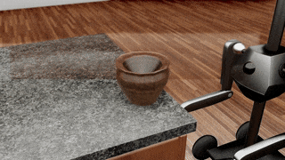

##### Magnebot

# Grasp action

The `grasp(target, arm)` action utilizes a fundamentally physically impossible process for grasping objects. While trying to grasp an object, if the "magnet" end effector comes into contact with the object, the object "sticks" to the magnet. 

In the backend code, the held object's Rigidbody is destroyed and the object is parented to the magnet. The object's mass is temporarily added to the magnet's mass.

This action has a few potentially unintuitive aspects:

- A magnet can never lose its grip on an object unless the controller explicitly calls `drop(target, arm)`.
- A magnet can hold any number of objects, provided that it has enough free surface area that it can still come in contact with the target object.
- Although physically impossible, the `grasp(target, arm)` action *is* physically responsive. A heavy object will behave very differently than a light object. A magnet can *stick* to any object but the Magnebot might not be strong enough to actually *lift* every object. Likewise, the object does remain physically present in the scene; it is considered to be an extension of the magnet. Held objects can collide with other objects.
- The `grasp(target, arm)` action ends as soon as the magnet grasps the object. If you want the arm to also reset, call `reset_arm(arm)`.



Before a `grasp(target, arm)` action:

```
magnebot
....column
........torso
............shoulder
................elbow
....................magnet
object
```

After a `grasp(target, arm)` action:

```
magnebot
....column
........torso
............shoulder
................elbow
....................magnet
........................object
```

After a `drop(target, arm)` action:

```
magnebot
....column
........torso
............shoulder
................elbow
....................magnet
object
```

## Automatic IK orientation solver

Like `reach_for(target, arm)`, `grasp(target, arm)` has optional `target_orientation` and `orientation_mode` parameters. [Read this for more information.](arm_articulation.md)

## Resetting the torso

By default, the Magnebot's torso target position is set to its current position at the end of the action. Due to a 1-frame delay in the output data, this sometimes causes the torso to drop slightly. To prevent this, set `set_torso=False`. For example: `magnebot.grasp(target=1, arm=Arm.right, set_torso=False)`.

***

**Next: [Camera actions](camera.md)**

[Return to the README](../../../README.md)
