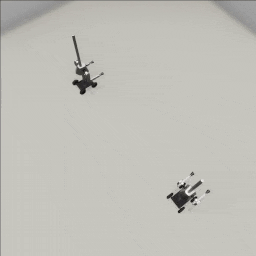
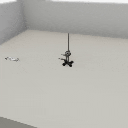

##### Magnebot

# Multi-agent simulations

Creating a multi-agent simulation with `Magnebot` agents is as simple as adding two `Magnebot` add-ons. Magnebot agents can move concurrently and halt mid-action. Each Magnebot has separate [dynamic data](../../api/magnebot_dynamic.md), including image data.

The default ID of a `Magnebot` is 0. To add multiple Magnebots, we need to set the `robot_id` parameter in the constructor to a unique integer.

This controller will add 2 Magnebots to the scene. One will move backwards by 2 meters and one will move forwards by 4 meters. The simulation ends when the first Magnebot finishes moving backwards by 2 meters.

```python
from tdw.controller import Controller
from tdw.tdw_utils import TDWUtils
from tdw.add_ons.third_person_camera import ThirdPersonCamera
from magnebot import Magnebot, ActionStatus

c = Controller()
# Create a camera.
camera = ThirdPersonCamera(position={"x": 2, "y": 6, "z": -1.5},
                           look_at={"x": 0, "y": 0.5, "z": 0},
                           avatar_id="a")
# Add two Magnebots.
magnebot_0 = Magnebot(position={"x": -2, "y": 0, "z": 0},
                      robot_id=c.get_unique_id())
magnebot_1 = Magnebot(position={"x": 2, "y": 0, "z": 0},
                      robot_id=c.get_unique_id())
c.add_ons.extend([camera, magnebot_0, magnebot_1])
# Load the scene.
c.communicate([{"$type": "load_scene",
                "scene_name": "ProcGenScene"},
               TDWUtils.create_empty_room(12, 12)])
# Move the Magnebots.
magnebot_0.move_by(-2)
magnebot_1.move_by(4)
while magnebot_0.action.status == ActionStatus.ongoing:
    c.communicate([])
c.communicate([])
c.communicate({"$type": "terminate"})
```

Result:



You can just as easily add a `Magnebot` and a `Robot` (or any other agent) to the scene:

```python
from tdw.controller import Controller
from tdw.tdw_utils import TDWUtils
from tdw.add_ons.robot import Robot
from tdw.add_ons.third_person_camera import ThirdPersonCamera
from magnebot import Magnebot, ImageFrequency, ActionStatus

c = Controller()
robot: Robot = Robot(robot_id=c.get_unique_id(), name="ur5", position={"x": -0.4, "y": 0, "z": 2.6})
magnebot: Magnebot = Magnebot(robot_id=c.get_unique_id(), position={"x": 0, "y": 0, "z": -0.5},
                              image_frequency=ImageFrequency.never)
camera: ThirdPersonCamera = ThirdPersonCamera(position={"x": -6, "y": 4, "z": -2},
                                              avatar_id="a",
                                              look_at={"x": 0, "y": 0, "z": -0.25})
c.add_ons.extend([robot, magnebot, camera])
c.communicate(TDWUtils.create_empty_room(12, 12))

# Wait for the robots to initialize.
while robot.joints_are_moving() or magnebot.action.status == ActionStatus.ongoing:
    c.communicate([])

robot.set_joint_targets(targets={robot.static.joint_ids_by_name["shoulder_link"]: 45,
                                 robot.static.joint_ids_by_name["forearm_link"]: -65})
magnebot.move_by(1)
while robot.joints_are_moving() or magnebot.action.status == ActionStatus.ongoing:
    c.communicate([])
c.communicate({"$type": "terminate"})
```

Result:



***

[Return to the README](../../../README.md)

***

Examples controllers:

- [multi_agent.py.py](https://github.com/alters-mit/magnebot/blob/main/controllers/examples/magnebot/multi_agent.py) A minimal multi-agent simulation with Magnebots.
- [magnebot_and_robot.py](https://github.com/alters-mit/magnebot/blob/main/controllers/examples/magnebot/magnebot_and_robot.py) A minimal multi-agent simulation with a Magnebot and a robot.
- [multi_magnebot.py](https://github.com/alters-mit/magnebot/blob/main/controllers/examples/magnebot/multi_magnebot.py) A much more sophisticated example controller. Includes a multi-Magnebot simulation with basic agent planning.