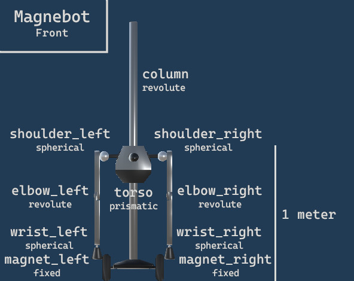
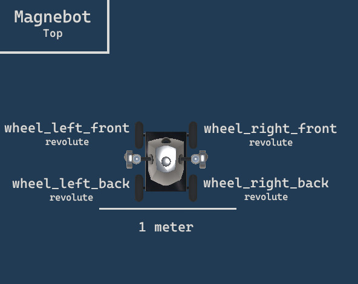

##### Magnebot

# Output Data

*For more information regarding TDW output data, [read this](https://github.com/threedworld-mit/tdw/blob/master/Documentation/lessons/core_concepts/output_data.md).*

*For more information regarding TDW image output data, [read this](https://github.com/threedworld-mit/tdw/blob/master/Documentation/lessons/core_concepts/images.md).*

[`Magnebot`](../../api/magnebot.md) includes static data about the agent (such as object IDs) and dynamic data (such as joint angles). 

## Static Magnebot data

Static Magnebot data is stored in `magnebot.static`. This is a [`MagnebotStatic` object](../../api/magnebot_static.md).

For convenience's sake, joint IDs are sorted into dictionaries:

- `magnebot.static.arm_joints` is a dictionary where key = [`ArmJoint`](../../api/arm_joint.md) and value = a joint ID.
- `magnebot.static.wheels` is a dictionary where key = [`Wheel`](../../api/wheel.md) and value = a joint ID.
- `magnebot.magnets` is a dictionary where key = [`Arm`](../../api/arm.md) and value = a joint ID.
- `magnebot.static.joints` is a dictionary key = a Joint ID and value = [`JointStatic`](https://github.com/threedworld-mit/tdw/blob/master/Documentation/python/robot_data/joint_static.md).

This example will add a Magnebot to the scene and print the joint ID and segmentation of each arm joint, wheel, and magnet:

```python
from tdw.controller import Controller
from tdw.tdw_utils import TDWUtils
from magnebot import Magnebot

c = Controller()
magnebot = Magnebot()
c.add_ons.append(magnebot)
c.communicate(TDWUtils.create_empty_room(12, 12))

print("Arm joints:")
for arm_joint in magnebot.static.arm_joints:
    joint_id = magnebot.static.arm_joints[arm_joint]
    segmentation_color = magnebot.static.joints[joint_id].segmentation_color
    print(arm_joint, joint_id, segmentation_color)

print("")
print("Wheels:")
for wheel in magnebot.static.wheels:
    joint_id = magnebot.static.wheels[wheel]
    segmentation_color = magnebot.static.joints[joint_id].segmentation_color
    print(wheel, joint_id, segmentation_color)

print("")
print("Magnets:")
for magnet in magnebot.static.magnets:
    joint_id = magnebot.static.magnets[magnet]
    segmentation_color = magnebot.static.joints[joint_id].segmentation_color
    print(magnet, joint_id, segmentation_color)

c.communicate({"$type": "terminate"})
```





## Dynamic Magnebot data

Dynamic Magnebot data is stored in `self.magnebot.dynamic`. This is a [`MagnebotDynamic` object](../../api/magnebot_static.md). It is updated at the end of every [action](actions.md).

This will print the position of each joint:

```python
from tdw.controller import Controller
from tdw.tdw_utils import TDWUtils
from magnebot import Magnebot

c = Controller()
magnebot = Magnebot()
c.add_ons.append(magnebot)
c.communicate(TDWUtils.create_empty_room(12, 12))

for arm_joint in magnebot.static.arm_joints:
    joint_id = magnebot.static.arm_joints[arm_joint]
    position = magnebot.dynamic.joints[joint_id].position
    print(arm_joint, position)

c.communicate({"$type": "terminate"})
```

This will print each object held in each magnet:

```python
from tdw.controller import Controller
from tdw.tdw_utils import TDWUtils
from magnebot import Magnebot

c = Controller()
magnebot = Magnebot()
c.add_ons.append(magnebot)
c.communicate(TDWUtils.create_empty_room(12, 12))

for arm in magnebot.dynamic.held:
    print(arm, magnebot.dynamic.held[arm])

c.communicate({"$type": "terminate"})
```

Raw image data is stored in `magnebot.dynamic.images`, a dictionary where key = pass mask (`_img`, `_id`, or `_depth`) and value = raw numpy image array.

- To save the images to disk, call `magnebot.dynamic.save_images(path)`.
- To get PIL images, call `magnebot.dynamic.get_pil_images()`
- To get depth values, call `magnebot.dynamic.get_depth_values()`
- To get a point cloud, call `magnebot.dynamic.get_point_cloud()`

***

**Next: [Actions](actions.md)**

[Return to the README](../../../README.md)

***

Example controllers:

- [output_data.py](https://github.com/alters-mit/magnebot/blob/main/controllers/examples/magnebot/output_data.py) Print static object data, static Magnebot data, dynamic object data, and dynamic Magnebot data.