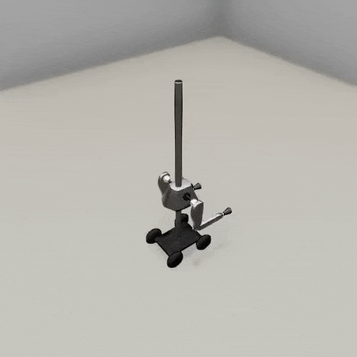

##### Magnebot

# Third-person cameras

*For more information regarding TDW cameras and avatars, [read this](https://github.com/threedworld-mit/tdw/blob/master/Documentation/lessons/core_concepts/avatars.md).*

*For more information regarding TDW camera controls, [read this](https://github.com/threedworld-mit/tdw/blob/master/Documentation/lessons/camera_controls/overview.md).*

*For more information regarding TDW image output data, [read this](https://github.com/threedworld-mit/tdw/blob/master/Documentation/lessons/core_concepts/images.md).*

To add a third-person camera to a scene, add a [`ThirdPersonCamera`](https://github.com/threedworld-mit/tdw/blob/master/Documentation/python/add_ons/third_person_camera.md). A third-person camera can optionally follow the Magnebot and return images per-frame.

This controller will add a third-person camera to the scene and save images per-frame:

```python
from tdw.controller import Controller
from tdw.tdw_utils import TDWUtils
from tdw.add_ons.third_person_camera import ThirdPersonCamera
from tdw.add_ons.image_capture import ImageCapture
from tdw.backend.paths import EXAMPLE_CONTROLLER_OUTPUT_PATH
from magnebot import Magnebot, ActionStatus

c = Controller()
magnebot = Magnebot()
# Create a camera and enable image capture.
camera = ThirdPersonCamera(position={"x": 2, "y": 3, "z": -1.5},
                           look_at=magnebot.robot_id,
                           avatar_id="a")
path = EXAMPLE_CONTROLLER_OUTPUT_PATH.joinpath("magnebot_third_person_camera")
print(f"Images will be saved to: {path}")
capture = ImageCapture(avatar_ids=["a"], path=path)
# Note the order of add-ons. The Magnebot must be added first so that the camera can look at it.
c.add_ons.extend([magnebot, camera, capture])
c.communicate([{"$type": "load_scene",
                "scene_name": "ProcGenScene"},
               TDWUtils.create_empty_room(12, 12)])
magnebot.move_by(3)
while magnebot.action.status == ActionStatus.ongoing:
    c.communicate([])
c.communicate([])
magnebot.turn_by(45)
while magnebot.action.status == ActionStatus.ongoing:
    c.communicate([])
c.communicate([])
magnebot.move_by(-2)
while magnebot.action.status == ActionStatus.ongoing:
    c.communicate([])
c.communicate([])
c.communicate({"$type": "terminate"})
```

Result:



***

**Next: [Occupancy maps](occupancy_map.md)**

[Return to the README](../../../README.md)

***

Examples controllers:

- [third_person_camera.py](https://github.com/alters-mit/magnebot/blob/main/controllers/examples/magnebot/third_person_camera.py) A simple example of a third-person camera.
