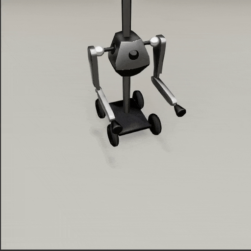

##### MagnebotController

# Arm articulation

Arm articulation actions move a Magnebot's arm joints.

- `reach_for(target, arm)`
- `grasp(target, arm)`
- `drop(target, arm)`
- `reset_arm(arm)`

During an arm articulation action, the Magnebot is *immovable*, meaning that its root object can't move or rotate.

## Inverse Kinematics

Two of the Magnebot's arm articulation actions, `reach_for(target, arm)` and `grasp(target, arm)`, use an inverse kinematics (IK) solver called [ikpy](https://github.com/Phylliade/ikpy). The `magnebot` Python module will automatically install 3.1 (which is not the most up-to-date version but is the correct version for `magnebot`). `magnebot` includes a few modified scripts from `ikpy` to handle prismatic joints.

The `reach_for(target, arm)` and `grasp(target, arm)` actions have optional `target_orientation` and `orientation_mode` parameters. `target_orientation` is the directional vector the Magnebot's magnet should align with, and `orientation_mode` is the referential vector. [For more information, read this.](https://notebook.community/Phylliade/ikpy/tutorials/Orientation) 

If `orientation_mode` and `target_orientation` are set to `none`, the solver will use the "full" referential frame, which is typically the most "normal" looking motion (the arm will extend towards the target). However, these are not typically the *best* orientation parameters; an IK action might fail with one set of orientation parameters and succeed with another: 

```python
from tdw.add_ons.third_person_camera import ThirdPersonCamera
from magnebot import MagnebotController, Arm
from magnebot.ik.target_orientation import TargetOrientation
from magnebot.ik.orientation_mode import OrientationMode

c = MagnebotController(skip_frames=0)
c.init_scene()
camera = ThirdPersonCamera(position={"x": 0.6, "y": 1.6, "z": 1.6},
                           look_at={"x": 0, "y": 0, "z": 0})
c.add_ons.append(camera)
target = {"x": 0.2, "y": 0.5, "z": 0.5}
# Use default orientation parameters (auto, auto).
c.reach_for(target=target, arm=Arm.left)
c.reset_arm(arm=Arm.left)
# Explicitly set orientation parameters. The motion will be very different!
c.reach_for(target=target, arm=Arm.left,
            target_orientation=TargetOrientation.right, orientation_mode=OrientationMode.z)
c.end()
```

Result:



### Automatic IK orientation solver

By default, `target_orientation=TargetOrientation.auto` and `orientation_mode=OrientationMode.auto`: 

```python
from magnebot import MagnebotController, Arm

c = MagnebotController()
c.init_scene()
# Use default orientation parameters (auto, auto).
target = {"x": 0.2, "y": 0.5, "z": 0.5}
c.reach_for(target=target, arm=Arm.left)
```

This means that the Magnebot will automatically choose an orientation solution, given the target position. It does this by comparing the target position to an array of pre-calculated positions and orientations. The positions and orientations were pre-calculated using `ik_solution.py` which can be found in the `util/` directory of this repo.

Additionally, it is possible for the IK action to fail even after taking a guess. In these cases, if orientation parameters are (`auto`, `auto`), the Magnebot will try to readjust the arm using parameters from neighboring cells in the grid of solutions (in other words, the Magnebot may try more than one motion to reach the target). If the parameters are set to anything else, the Magnebot won't automatically make multiple attempts to reach the target position.

The script `ik_images.py` (also located in `util/`) will generate images of vertical slices of the orientation solutions, which can be found [here](https://github.com/alters-mit/magnebot/tree/master/doc/images/ik). Below are a few examples:

  

### Accuracy and performance

We've benchmarked the IK orientation solver using `controllers/tests/benchmark/ik.py`. In this test controller, the Magnebot will `reach_for()` an array of target positions and record whether the outcome of the action was guessed correctly. A correct guess is an action that returns `success` or `cannot_reach`. If the action returns `cannot_reach`, this means that the solver knew ahead of time that the action was going to fail and the Magnebot never tried to bend its arm, rather than reaching for an impossible target. If the action returns `failed_to_bend` or `failed_to_reach`, this counts as a failure; the Magnebot tried to reach for a position that the solver guessed was reachable, but failed to arrive at the target.

| Action                                                       | Accuracy | Time elapsed (200 trials) |
| ------------------------------------------------------------ | -------- | ------------------------- |
| `reach_for(target, arm)`                                     | 94.5%    | 02:45                     |
| `reach_for(target, arm, TargetOrientation.none, OrientationMode.none)` | 63%      | 02:15                     |

### Limitations to the IK orientation solver

- The pre-calculated IK solutions are only accurate assuming that the Magnebot's arms are in their neutral position. Successive `reach_for()` or `grasp()` actions will be less accurate than the initial action. You should either:
  - Reset the arms to their neutral positions with the `reset_arm()` function between IK actions.
  - Explicitly set IK orientation parameters (see below).
- The IK solver doesn't (and can't) automatically handle situations where there are obstructions such as walls, other objects, objects held by a magnet, or the Magnebot's body.
- **There is no general solution for orientation parameters.** We can't provide general guidelines for which orientation parameters to use for an arbitrary pose and target. It's far too complex a problem! The (`auto`, `auto`) parameters are meant to establish an accurate baseline under reasonable constraints. If you want to select orientation parameters accurately and automatically for more complex cases, you'll need to train your model to try different orientation parameters.

### Explicitly setting IK orientation parameters

You can explicitly set the `target_orientation` and `orientation_mode` parameters in the `reach_for()` and `grasp()` action. You might want to do this if:

- You want to try different orientations to move the arm around an obstruction.
- You want to use sequential IK actions without having to call `reset_arm()`.
- You want to train the Magnebot using different orientations (which might be more accurate than the default `auto` approach).
- You need to the Magnebot to pick up an object at a particular angle.

Some guidelines regarding the orientation parameters:

- For a complete list of enum values for `TargetOrientation` and `OrientationMode`, read [this](api/target_orientation.md) and [this](api/orientation_mode.md).
- Both parameters must be `auto` or neither.
- Both parameters must be `none` or neither.
- Setting both parameters to `none` is *usually* the best solution and will  make the arm bend in the most "direct" path. Approximately 50% of the pre-calculated solutions use (`none`, `none`) (not including positions where no solution is possible).

### Setting the `arrived_at` parameter

The `arrived_at` parameter in the `reach_for()` action determines minimum distance from the magnet to the target. The action immediately stops if the magnet is within this distance. Increasing `arrived_at` therefore "improves" the success rate of an IK action.

***

**Next: [Grasp action](grasp.md)**

[Return to the README](../../../README.md)