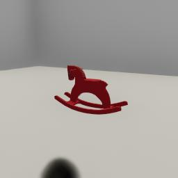

##### MagnebotController

# Camera actions

Camera actions require only one `communicate()` call to complete.

## Rotation

`rotate_camera(roll, pitch, yaw)` will rotate the camera by (roll, pitch, yaw) in degrees:

```python
from magnebot import MagnebotController, ActionStatus

c = MagnebotController()
c.init_scene()
# Rotate the camera.
status = c.rotate_camera(roll=0, pitch=45, yaw=0)
assert status == ActionStatus.success, status
# Clamped pitch.
status = c.rotate_camera(pitch=90)
assert status == ActionStatus.clamped_camera_rotation, status
c.end()
```

The camera rotation is clamped within a certain range, defined by Euler angles:

```python
from magnebot.actions.rotate_camera import RotateCamera

print(RotateCamera.CAMERA_RPY_CONSTRAINTS)
```

## Look At

Rather than rotating the camera by setting rotational angles, you can look at a target object or position with the `look_at(target)` command. `target` can be either an object ID (an integer), a dictionary (a position), or a numpy array (a position):

```python
from tdw.tdw_utils import TDWUtils
from tdw.backend.paths import EXAMPLE_CONTROLLER_OUTPUT_PATH
from magnebot import MagnebotController
from magnebot.util import get_default_post_processing_commands


class LookAtExample(MagnebotController):
    """
    Minimal example of the `look_at(target)` action.
    """

    def init_scene(self):
        scene = [{"$type": "load_scene",
                  "scene_name": "ProcGenScene"},
                 TDWUtils.create_empty_room(12, 12)]
        objects = []
        objects.extend(self.get_add_physics_object(model_name="rh10",
                                                   position={"x": -1, "y": 0, "z": 2},
                                                   object_id=self.get_unique_id()))
        self._init_scene(scene=scene,
                         objects=objects,
                         position={"x": 1, "y": 0, "z": -3},
                         rotation={"x": 0, "y": 46, "z": 0},
                         post_processing=get_default_post_processing_commands())


d = EXAMPLE_CONTROLLER_OUTPUT_PATH.joinpath("magnebot_look_at")
if not d.exists():
    d.mkdir(parents=True)
print(f"Images will be saved to: {d}")
c = LookAtExample()
c.init_scene()
c.look_at(target={"x": -1, "y": 0, "z": 2})
c.magnebot.dynamic.save_images(output_directory=d)
c.end()
```

Result:


## Movement

`move_camera(position)` will move the camera to/by a position; by default, it will move the camera by a positional offset:

```python
from magnebot import MagnebotController

c = MagnebotController()
c.init_scene()
c.move_camera({"x": 0, "y": 0.6, "z": 0})
c.end()
```

## Reset the camera

You can reset the camera to its default position with by calling `reset_camera()`:

```python
from magnebot import MagnebotController

c = MagnebotController()
c.init_scene()
c.move_camera({"x": 0, "y": 0.6, "z": 0})
c.reset_camera()
c.end()
```

Set the optional `position` and `rotation` parameters to reset only the position or rotation:

```python
from magnebot import MagnebotController

c = MagnebotController()
c.init_scene()
c.move_camera({"x": 0, "y": 0.6, "z": 0})
c.reset_camera(position=True, rotation=False)
c.end()
```

***

**Next: [Third-person cameras](third_person_camera.md)**

[Return to the README](../../../README.md)

***

Examples controllers:

- [look_at.py](https://github.com/alters-mit/magnebot/blob/main/controllers/examples/magnebot_controller/look_at.py) Minimal example of the `look_at(target)` action.