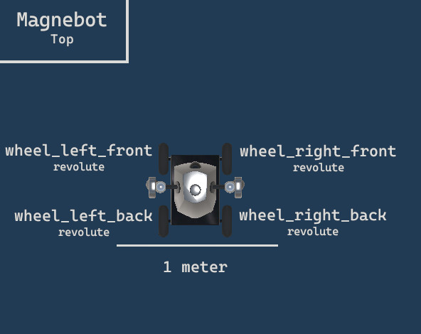

##### MagnebotController

# Output Data

*For more information regarding TDW output data, [read this](https://github.com/threedworld-mit/tdw/blob/master/Documentation/lessons/core_concepts/output_data.md).*

*For more information regarding TDW image output data, [read this](https://github.com/threedworld-mit/tdw/blob/master/Documentation/lessons/core_concepts/images.md).*

[`MagnebotController`](../../api/magnebot_controller.md) includes output data for the world state and for the Magnebot agent. This data is further divided into *static* data that isn't expected to change per-frame (such as object IDs) and *dynamic* data that can change per-frame (such as Magnebot joint angles).

## Object data

Object data is stored in `self.objects`, which is an [`ObjectManager` add-on](https://github.com/threedworld-mit/tdw/blob/master/Documentation/python/add_ons/object_manager.md).

### Static object data

Static object data is stored in `self.objects.objects_static`:

```python
from tdw.tdw_utils import TDWUtils
from magnebot import MagnebotController


class MyController(MagnebotController):
    def init_scene(self):
        scene = [{"$type": "load_scene",
                  "scene_name": "ProcGenScene"},
                 TDWUtils.create_empty_room(12, 12)]
        objects = self.get_add_physics_object(model_name="cabinet_36_wood_beach_honey",
                                              position={"x": 0.04, "y": 0, "z": 1.081},
                                              kinematic=True,
                                              object_id=self.get_unique_id())
        self._init_scene(scene=scene,
                         objects=objects,
                         position={"x": 1, "y": 0, "z": -3},
                         rotation={"x": 0, "y": 46, "z": 0})


if __name__ == "__main__":
    c = MyController()
    c.init_scene()
    for object_id in c.objects.objects_static:
        name = c.objects.objects_static[object_id].name
        segmentation_color = c.objects.objects_static[object_id].segmentation_color
        print(object_id, name, segmentation_color)
```

### Dynamic object data

Dynamic output data is stored in `self.objects.transforms`:

```python
from tdw.tdw_utils import TDWUtils
from magnebot import MagnebotController

class MyController(MagnebotController):
    def init_scene(self):
        scene = [{"$type": "load_scene",
                  "scene_name": "ProcGenScene"},
                 TDWUtils.create_empty_room(12, 12)]
        objects = self.get_add_physics_object(model_name="cabinet_36_wood_beach_honey",
                                              position={"x": 0.04, "y": 0, "z": 1.081},
                                              kinematic=True,
                                              object_id=self.get_unique_id())
        self._init_scene(scene=scene,
                         objects=objects,
                         position={"x": 1, "y": 0, "z": -3},
                         rotation={"x": 0, "y": 46, "z": 0})


if __name__ == "__main__":
    c = MyController()
    c.init_scene()
    for object_id in c.objects.transforms:
        position = c.objects.transforms[object_id].position
        print(object_id, position)
```

By default, `self.objects.bounds` is always empty and `self.objects.rigidbodies` is always empty (in order to make the simulation run faster).

***

## Magnebot data

### Static Magnebot data

Static Magnebot data is stored in `self.magnebot.static`. This is a [`MagnebotStatic` object](../../api/magnebot_static.md).

For convenience's sake, joint IDs are sorted into dictionaries:

- `self.magnebot.static.arm_joints` is a dictionary where key = [`ArmJoint`](../../api/arm_joint.md) and value = a joint ID.
- `self.magnebot.static.wheels` is a dictionary where key = [`Wheel`](../../api/wheel.md) and value = a joint ID.
- `self.magnebot_static.magnets` is a dictionary where key = [`Arm`](../../api/arm.md) and value = a joint ID.
- `self.magnebot.static.joints` is a dictionary key = a Joint ID and value = [`JointStatic`](https://github.com/threedworld-mit/tdw/blob/master/Documentation/python/robot_data/joint_static.md).

This example will add a Magnebot to the scene and print the joint ID and segmentation of each arm joint, wheel, and magnet:

```python
from magnebot import MagnebotController

c = MagnebotController()
c.init_scene()

print("Arm joints:")
for arm_joint in c.magnebot.static.arm_joints:
    joint_id = c.magnebot.static.arm_joints[arm_joint]
    segmentation_color = c.magnebot.static.joints[joint_id].segmentation_color
    print(arm_joint, joint_id, segmentation_color)

print("")
print("Wheels:")
for wheel in c.magnebot.static.wheels:
    joint_id = c.magnebot.static.wheels[wheel]
    segmentation_color = c.magnebot.static.joints[joint_id].segmentation_color
    print(wheel, joint_id, segmentation_color)

print("")
print("Magnets:")
for magnet in c.magnebot.static.magnets:
    joint_id = c.magnebot.static.magnets[magnet]
    segmentation_color = c.magnebot.static.joints[joint_id].segmentation_color
    print(magnet, joint_id, segmentation_color)

c.end()
```




### Dynamic Magnebot data

Dynamic Magnebot data is stored in `self.magnebot.dynamic`. This is a [`MagnebotDynamic` object](../../api/magnebot_static.md). It is updated at the end of every [action](actions.md).

This will print the position of each joint:

```python
from magnebot import MagnebotController

c = MagnebotController()
c.init_scene()
for arm_joint in c.magnebot.static.arm_joints:
    joint_id = c.magnebot.static.arm_joints[arm_joint]
    position = c.magnebot.dynamic.joints[joint_id].position
    print(arm_joint, position)
c.end()
```

This will print each object held in each magnet:

```python
from magnebot import MagnebotController

c = MagnebotController()
c.init_scene()
for arm in c.magnebot.static.magnets:
    print(arm, c.magnebot.dynamic.held[arm])
c.end()
```

Raw image data is stored in `self.magnebot.dynamic.images`, a dictionary where key = pass mask (`_img`, `_id`, or `_depth`) and value = raw numpy image array.

- To save the images to disk, call `c.magnebot.dynamic.save_images(path)`.
- To get PIL images, call `c.magnebot.dynamic.get_pil_images()`
- To get depth values, call `c.magnebot.dynamic.get_depth_values()`
- To get a point cloud, call `c.magnebot.dynamic.get_point_cloud()`

***

**Next: [Actions](actions.md)**

[Return to the README](../../../README.md)

***

Example controllers:

- [output_data.py](https://github.com/alters-mit/magnebot/blob/main/controllers/examples/magnebot_controller/output_data.py) Print static object data, static Magnebot data, dynamic object data, and dynamic Magnebot data.
