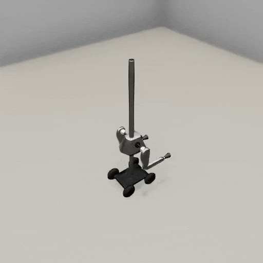

##### MagnebotController

# Third-person cameras

To add a third-person camera to a scene, add a [`ThirdPersonCamera`](https://github.com/threedworld-mit/tdw/blob/master/Documentation/python/add_ons/third_person_camera.md). A third-person camera can optionally follow the Magnebot and return images per-frame.

- [This document explains cameras and avatars are in TDW.](https://github.com/threedworld-mit/tdw/blob/master/Documentation/lessons/core_concepts/avatars.md)
- [This tutorial covers camera controls in TDW.](https://github.com/threedworld-mit/tdw/blob/master/Documentation/lessons/camera_controls/overview.md)
- [This document explains how to save images from a camera.](https://github.com/threedworld-mit/tdw/blob/master/Documentation/lessons/core_concepts/images.md)

This controller will add a third-person camera to the scene and save images per-frame:

```python
from tdw.add_ons.third_person_camera import ThirdPersonCamera
from tdw.add_ons.image_capture import ImageCapture
from tdw.backend.paths import EXAMPLE_CONTROLLER_OUTPUT_PATH
from magnebot import MagnebotController

c = MagnebotController()
c.init_scene()

# Create a camera and enable image capture.
camera = ThirdPersonCamera(position={"x": 2, "y": 3, "z": -1.5},
                           look_at=c.magnebot.robot_id,
                           avatar_id="a")
path = EXAMPLE_CONTROLLER_OUTPUT_PATH.joinpath("magnebot_third_person_camera")
print(f"Images will be saved to: {path}")
capture = ImageCapture(avatar_ids=["a"], path=path)
c.add_ons.extend([camera, capture])

c.move_by(3)
c.turn_by(45)
c.move_by(-2)
c.end()
```

Result:



***

**Next: [Occupancy maps](occupancy_map.md)**

[Return to the README](../../../README.md)

***

Examples controllers:

- [third_person_camera.py](https://github.com/alters-mit/magnebot/blob/main/controllers/examples/magnebot_controller/third_person_camera.py) A simple example of a third-person camera.
- [social_image.py](https://github.com/alters-mit/magnebot/blob/main/controllers/examples/magnebot_controller/social_image.py) Generate the social image for this repo.
