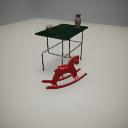

# SceneState

`from magnebot.scene_state import SceneState`

Data for the current state of the scene.
This is used internally to monitor the status of the scene and Magnebot during an action.
This is cached in the controller at the end an action as the most-recent state.

```python
from magnebot import Magnebot

m = Magnebot()
m.init_scene(scene="2a", layout=1, room=1)
m.move_by(1)

# m.state is the SceneState of the most-recent frame.
# Save the image.
m.state.save_images(output_directory="dist")

m.end()
```

***

## Fields

- `magnebot_transform` The [transform data](transform.md) of the Magnebot.

```python
from magnebot import Magnebot

m = Magnebot()
m.init_scene(scene="2a", layout=1, room=1)
print(m.state.magnebot_transform.position)
```

- `joint_transforms` The [transform data](transform.md) of the Magnebot's joints. Key = The ID of the joint.

```python
from magnebot import Magnebot

m = Magnebot()
m.init_scene(scene="2a", layout=1, room=1)
for j_id in m.state.joint_transforms:
    print(m.state.joint_transforms[j_id].position)
```

- `joint_angles` The angles of each joint. Key = The ID of the joint. Value = The angles of the joint in degrees as a numpy array. This is mainly useful for the backend code.

- `held` A dictionary of object IDs currently held by the Magnebot. Key = The arm. Value = a numpy array of object IDs.

```python
from magnebot import Magnebot, Arm

m = Magnebot()
m.init_scene(scene="2a", layout=1, room=1)
print(m.state.held[Arm.left]) # []
```

- `object_transforms` A dictionary of object [transform data](transform.md). Key = the object ID.

```python
from magnebot import Magnebot

m = Magnebot()
m.init_scene(scene="2a", layout=1, room=1)

# Print the position of each object.
for object_id in m.state.object_transforms:
    print(m.state.object_transforms[object_id].position)
```

- `projection_matrix` The [camera projection matrix](https://github.com/threedworld-mit/tdw/blob/master/Documentation/api/output_data.md#cameramatrices) of the Magnebot's camera as a numpy array.

- `camera_matrix` The [camera matrix](https://github.com/threedworld-mit/tdw/blob/master/Documentation/api/output_data.md#cameramatrices) of the Magnebot's camera as a numpy array.

- `images` The images rendered by the robot as dictionary. Key = the name of the pass. Value = the pass as a numpy array.

When a `SceneState` is created during an action, this is often empty. `Magnebot.state.images` always contains images.

```python
from magnebot import Magnebot

m = Magnebot(id_pass=True)
m.init_scene(scene="2a", layout=1, room=1)

# Get the ID pass.
id_pass = m.state.images["id"]
```

| Pass | Image | Description |
| --- | --- | --- |
| `"img"` |  | The rendered image. |
| `"id"` |  | The object color segmentation pass. If `id_pass == False` in the `Magnebot` constructor, this will be None. See `Magnebot.segmentation_color_to_id` and `Magnebot.objects_static` to map segmentation colors to object IDs. |
| `"depth"` |  | The depth values per pixel as a numpy array. Depth values are encoded into the RGB image; see `SceneState.get_depth_values()`. Use the camera matrices to interpret this data. |

- `third_person_images` Images rendered by third-person cameras as dictionary. Key = The camera ID. Value: A dictionary of image passes, structured exactly like `images` (see above).

***

## Functions

#### \_\_init\_\_

**`def __init__(self, resp: List[bytes])`**

| Parameter | Description |
| --- | --- |
| resp | The response from the build. |

#### save_images

**`def save_images(self, output_directory: Union[str, Path]) -> None`**

Save the ID pass (segmentation colors) and the depth pass to disk.
Images will be named: `[frame_number]_[pass_name].[extension]`
For example, the depth pass on the first frame will be named: `00000000_depth.png`
The image pass is a jpg file and the other passes are png files.

| Parameter | Description |
| --- | --- |
| output_directory | The directory that the images will be saved to. |

#### get_pil_images

**`def get_pil_images(self) -> dict`**

Convert each image pass from the robot camera to PIL images.

_Returns:_  A dictionary of PIL images. Key = the pass name (img, id, depth); Value = The PIL image (can be None)

#### get_depth_values

**`def get_depth_values(self) -> np.array`**

Convert the depth pass to depth values. Can be None if there is no depth image data.

_Returns:_  A decoded depth pass as a numpy array of floats.

